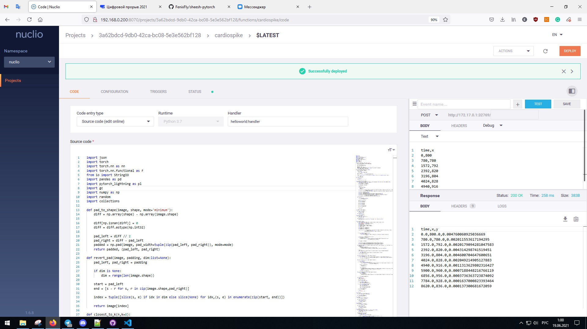
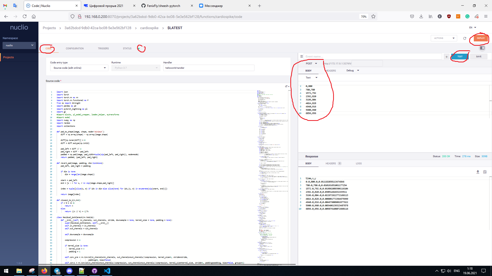
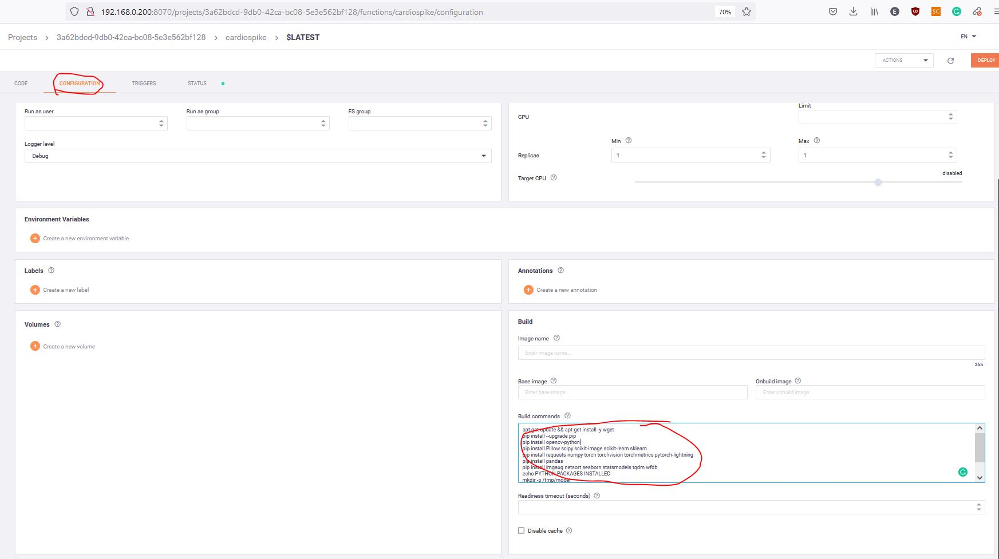

# sheesh-pytorch

Наше решение - сервис для детектирования признаков коронавируса с помощью сегментации спайков на основе данных об RR-интервалах с носимых устройств.

## Рабочее демо

Рабочее демо запущено по адресу: [http://cardiospike.ip3.ru/](http://cardiospike.ip3.ru/)

Сценарий пациента:

  - Залогиньтесь с логином/паролем xxx/yyy, вы попадете в личный кабинет пациента
  - В личном кабинете можно видеть последние исследования
  - По кнопке "Скачать демо данные" скачайте демо данные для тестирования. Затем нажмите кнопку "Загрузить тестовые данные" и выберите скачаный вами файл. 
  - Загруженный вами файл обработается в инференсе и появится новое исследование в личном кабинете. Если разлогиниться / залогиниться, то это исследование не исчезнет.   

## Строение проекта

Наше решение состоит из нескольких модулей

Фронтэнд - 

Бэкенд - 

Инференс модели - колбек-функция на языке Python, запущенная в Nuclio и общающаяся с бекендом по HTTP.

## Сборка и запуск проекта.


### Трейн


### Фронтенд


### Бэкенд


### Инференс

Для реализации мастабируемости инференс запускается через фреймворк Nuclio.
Фреймворк Nuclio на основе одного Python файла с функцией-коллбеком строит Docker образ, деплоит его на целевое устройство в требуемом количестве экземпляров, и балансирует нагрузку.



Для запуска nuclio требуется установить Docker и сам Nuclio, и зайти в веб-морду Nuclio

```bash
sudo snap install docker
sudo docker run -p 8070:8070 -v /var/run/docker.sock:/var/run/docker.sock -v /tmp:/tmp --name nuclio-dashboard quay.io/nuclio/dashboard:stable-amd64
```

Откройте [localhost:8070](http://localhost:8070/)
Нажмите кнопку "New Fucntion", выберите Runtime "Python 3.7" шаблон "helloworld"
Во вкладке "CODE" в поле "Source code" скопируйте код из файла [inference.py](inference/inference.py)



Во вкладке "CONFIGURE в поле "Build commands" скопируйте текст из файла [build.txt](inference/build.txt)



Нажмите Deploy. Когда докер успешно соберется и запустится, можно будет протестировать работоспособность. Для этого во вкладке "CODE" в поле "Post / BODY" вставьте текст:

```
time,x
0,800
780,780
1572,792
2392,820
3196,804
4024,828
4940,916
5900,960
6856,956

```

и нажмите кнопку "TEST". В поле снизу должен появиться результат с предсказанием в третьем столбце.
